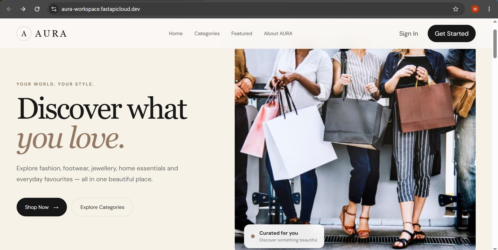
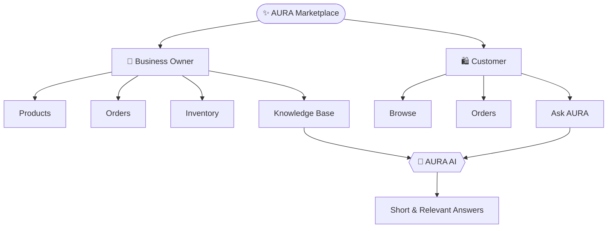
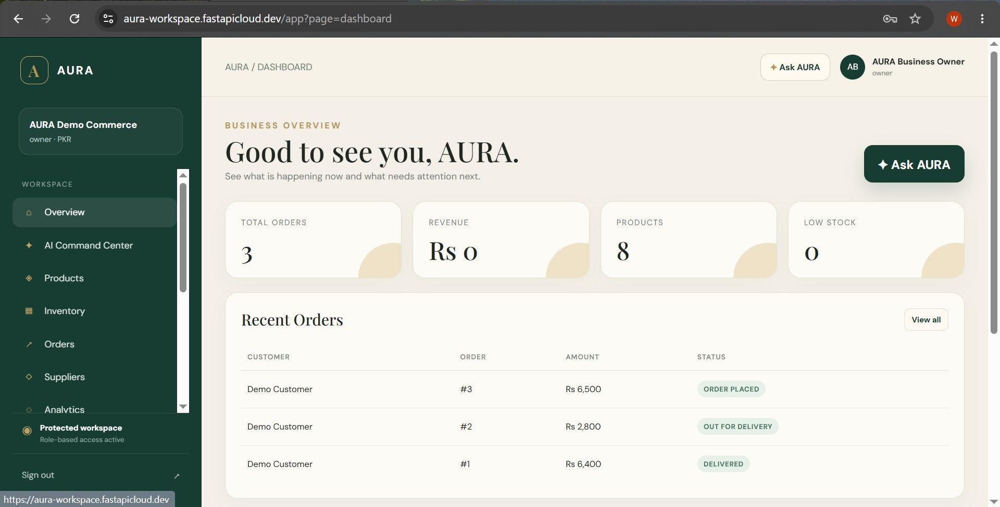
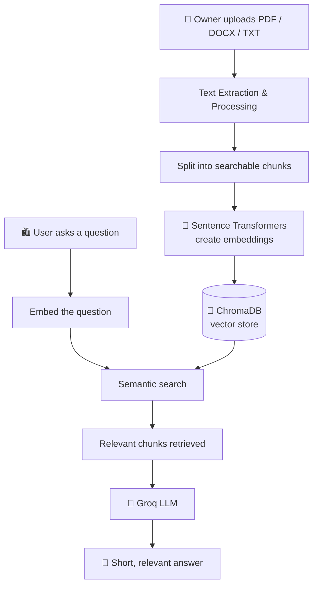
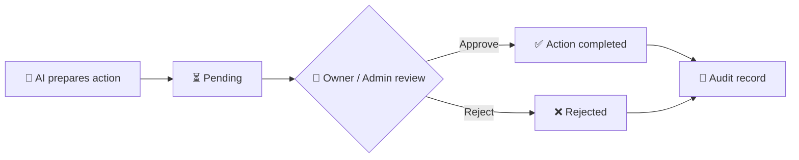
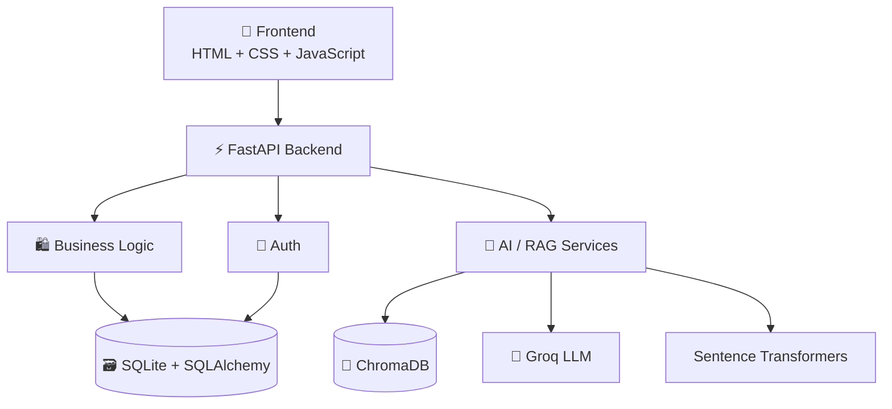

<div align="center">

# ✨ AURA Marketplace

### AI-Powered Marketplace & Business Management Platform

**Shop simply. Manage intelligently. Ask AURA.**

[](https://aura-workspace.fastapicloud.dev)
[](https://github.com/wajeehatariq999-arch/AURA_Workspace)


[Live Demo](https://aura-workspace.fastapicloud.dev) • [Features](#-features) • [Architecture](#-system-architecture) • [Quick Start](#-quick-start) • [Demo Guide](#-demo-walkthrough)
<br>


</div>

---

## 📑 Table of Contents

- [Overview](#-overview)
- [Key Highlights](#-key-highlights)
- [Features](#-features)
- [How RAG Works](#-how-rag-works)
- [AI Scope & Behavior](#-ai-scope--behavior)
- [Approval Center (Human-in-the-Loop)](#-approval-center-human-in-the-loop)
- [Security & Privacy](#-security--privacy)
- [System Architecture](#-system-architecture)
- [Technology Stack](#-technology-stack)
- [Data Model](#-data-model)
- [Project Structure](#-project-structure)
- [Quick Start](#-quick-start)
- [Demo Walkthrough](#-demo-walkthrough)
- [Roadmap](#-roadmap)
- [Author](#-author)

---

## 🌟 Overview

**AURA Marketplace** is a full-stack web application that unites a customer shopping experience with business management and focused AI assistance in a single platform.

| Role | What they can do |
|------|------------------|
| 👔 **Business Owner** | Manage products, inventory, orders, suppliers, analytics, documents and AI-assisted operations |
| 🛍️ **Customer** | Create an account, browse products, place orders, track their own orders and ask AURA questions |
| 🤖 **AURA AI** | Gives short, focused answers using authorized business data and owner-uploaded knowledge |

> **The core idea:** AURA is not just an online store, and it is not just a chatbot.
> It combines **E-Commerce + Business Operations + AI + RAG + Security + Human Approval** in one connected system.


---

## 📸 Screenshots

<table>
  <tr>
    <td align="center" width="50%">
      <b>👔 Business Owner Dashboard</b><br><br>
      
    </td>
    <td align="center" width="50%">
      <b>🛍️ Customer Dashboard</b><br><br>
      
    </td>
  </tr>
</table>
---

## 🎯 Key Highlights

| | Highlight | Description |
|---|-----------|-------------|
| 🛍️ | **Complete Marketplace** | Customers browse products and place orders |
| 👔 | **Business Management** | Owners manage products, inventory, orders and suppliers |
| 🤖 | **Focused AI** | AURA answers only marketplace and business-related questions |
| 📚 | **Owner Knowledge** | Upload PDF / DOCX / TXT files and use them as AI knowledge |
| 🧠 | **RAG** | Relevant information is retrieved from owner documents, not invented |
| 🔐 | **Role-Based Security** | Owner, Admin, Staff and Customer have different permissions |
| 🛡️ | **Customer Privacy** | Customers can only access their own data |
| ✅ | **Human Approval** | Important AI actions require owner/admin approval |
| 📊 | **Business Insights** | Analytics for orders, revenue and inventory |
| 🌐 | **Real Deployment** | Live FastAPI application on FastAPI Cloud |

---

## 🚀 Features

### 👔 Business Owner

<details open>
<summary><b>🏠 Dashboard</b></summary>

A quick overview of what needs attention:

- 📦 Total orders
- 💰 Revenue
- 🛍️ Total products
- ⚠️ Low-stock products
- 🧾 Recent orders
- 📊 Business activity

</details>

<details>
<summary><b>🛍️ Product Management</b></summary>

- ➕ Add and ✏️ edit products
- 🗂️ Manage categories
- 💰 Set prices
- 📦 Manage stock
- 🖼️ Add product images
- 🛒 Changes are instantly reflected in the customer-facing catalog

</details>

<details>
<summary><b>📦 Inventory Management</b></summary>

Monitor stock levels and let AURA answer questions like *"Which products need restocking?"* from live inventory data.

</details>

<details>
<summary><b>🧾 Order Management</b></summary>

- View customer orders and check order status
- Review order details
- Monitor recent order activity
- Ask AURA: *"What is the current order situation?"*

</details>

<details>
<summary><b>🚚 Supplier Management</b></summary>

Store supplier name, contact person, email, phone and address to support inventory and business workflows.

</details>

<details>
<summary><b>📊 Analytics</b></summary>

Review orders, revenue, product activity, inventory conditions and business trends.

</details>

<details>
<summary><b>📚 Knowledge Base</b></summary>

Upload business documents that AURA uses to answer relevant questions.

**Supported formats:** `PDF` · `DOCX` · `TXT`

**Example documents:** Return policy, refund policy, delivery policy, product information, store FAQs, business procedures.

</details>

### 🛍️ Customer

- 👤 **Self-service accounts** — sign up and sign in without owner involvement
- 🛍️ **Browse** products with images and prices
- 📦 **Place orders** and 🧾 **view their own orders**
- 🤖 **Ask AURA** about products, prices, availability, order status and store policies

**Supported product categories (examples):** 👕 Clothes · 👟 Shoes · 💍 Jewellery · 👜 Bags · 🧴 Body Care · 🏠 Home Products · 🎧 Electronics · 🎁 Gifts

### 📚 Owner Files → Customer Answers

One of AURA's signature features:

```
👔 Owner uploads "Return Policy.pdf"
              │
              ▼
🛍️ Customer asks: "What is your return policy?"
              │
              ▼
🤖 AURA retrieves the relevant section and replies with a short, grounded answer
```

This keeps the AI useful for real business information instead of inventing answers.

---

## 🧠 How RAG Works

AURA uses **Retrieval-Augmented Generation (RAG)** so answers come from the owner's own documents.



> AURA retrieves only the information relevant to the question instead of blindly using everything.

---

## 🎯 AI Scope & Behavior

AURA is **not** a general-purpose chatbot. It focuses on the marketplace and the business.

| ✅ In scope | 🚫 Out of scope |
|------------|----------------|
| Products, prices, availability | General knowledge questions |
| Orders and order status | Unrelated topics |
| Inventory and suppliers | |
| Store policies | |
| Owner-uploaded documents | |
| Business information | |

For out-of-scope questions (applies to both owners and customers), AURA replies politely:

> *"Sorry, this question is not related to AURA Marketplace. I can help with products, orders, store policies and other marketplace-related information."*

### 💬 Suggested Questions

Clickable suggestions appear above the AI input (e.g. *"Which products need restocking?"*, *"Show low-stock products."*).
Clicking one fills the input box so the user can review or edit it before sending — making AURA easy to use for non-technical users.

---

## ✅ Approval Center (Human-in-the-Loop)

Important AI-prepared actions require review by the owner or admin before they are executed.



📝 **Agent Activity** gives the owner visibility into AI runs, agent actions, approval decisions and important business events.

---

## 🔐 Security & Privacy

### Authentication
- Password hashing
- JWT-based authentication
- **HttpOnly** authentication cookies
- **CSRF** protection

### Role-Based Authorization

| Role | Level |
|------|-------|
| 👑 Owner | Full business access |
| 🛠️ Admin | Administrative access |
| 👩‍💼 Staff | Limited operational access |
| 🛍️ Customer | Own data only |

### Customer Privacy

| ✅ Allowed | ❌ Not allowed |
|-----------|---------------|
| Own orders | Another customer's orders |
| Own order status | Another customer's private data |
| Own customer information | Owner-only analytics and business data |

> Authorization is enforced on the **backend**, not just hidden in the frontend.

### Data Protection & Audit
- Customer orders are protected
- Business data is isolated per business
- Owner documents are protected
- Important activity is recorded in audit logs for traceability

---

## 🏗️ System Architecture



---

## 🧰 Technology Stack

| Layer | Technology | Purpose |
|-------|-----------|---------|
| Backend | 🐍 **Python**, ⚡ **FastAPI** | REST API and web backend |
| Frontend | 🎨 **HTML / CSS / JavaScript** | User interface |
| Database | 🗃️ **SQLite**, 🔗 **SQLAlchemy** | Storage and ORM |
| AI | 🤖 **Groq** | AI responses |
| Embeddings | 🧠 **Sentence Transformers** | Text embeddings |
| Vector Search | 🔎 **ChromaDB** | Semantic retrieval (RAG) |
| Documents | 📄 **PDF / DOCX / TXT** | Business knowledge |
| Auth | 🔐 **JWT / Cookies** | Authentication |
| Protection | 🛡️ **CSRF** | Request protection |
| Deployment | ☁️ **FastAPI Cloud** | Hosting |

---

## 🗄️ Data Model

| Area | Purpose |
|------|---------|
| 👤 Users | Authentication and roles |
| 🏢 Businesses | Business ownership and isolation |
| 🗂️ Categories | Product organization |
| 🛍️ Products | Marketplace catalog |
| 📦 Inventory | Stock management |
| 🧾 Orders | Customer purchases |
| 🚚 Suppliers | Supplier management |
| 📚 Documents | Owner knowledge |
| 🔎 Vector Store | RAG / semantic retrieval |
| ✅ Approvals | Human approval workflow |
| 🤖 Agent Activity | AI activity tracking |
| 📝 Audit Logs | Traceability and security |

---

## 📁 Project Structure

```
AURA/
├── app/
│   ├── api/                 # REST API routes
│   │   ├── auth.py
│   │   ├── products.py
│   │   ├── orders.py
│   │   ├── suppliers.py
│   │   └── ...
│   ├── services/            # AI, RAG and business logic
│   │   ├── agentic.py
│   │   ├── rag.py
│   │   └── ...
│   ├── models.py            # Database models
│   ├── database.py          # DB connection & session
│   ├── config.py            # App configuration
│   └── main.py              # FastAPI entry point
│
├── frontend/
│   ├── static/
│   │   ├── css/
│   │   └── js/
│   └── templates/           # HTML pages
│
├── data/
│   ├── documents/           # Owner-uploaded documents
│   ├── product_images/      # Product images
│   └── vector_store/        # RAG vector storage
│
├── requirements.txt
├── run.py
├── seed.py
├── .env.example
└── README.md
```

---

## ⚡ Quick Start

### Prerequisites
- Python 3.x (developed with Python 3.14)
- A [Groq API key](https://console.groq.com/)

### 1. Clone the repository

```bash
git clone https://github.com/wajeehatariq999-arch/AURA_Workspace.git
cd AURA_Workspace
```

### 2. Create a virtual environment

```bash
# Windows
py -3.14 -m venv .venv
.venv\Scripts\activate

# macOS / Linux
python3 -m venv .venv
source .venv/bin/activate
```

### 3. Install dependencies

```bash
pip install -r requirements.txt
```

### 4. Configure environment variables

Create a `.env` file from `.env.example`:

```env
SECRET_KEY=your-secret-key
GROQ_API_KEY=your-groq-api-key
```

> ⚠️ **Never commit `.env` or API keys to a public repository.**

### 5. Seed the application

```bash
python seed.py
```

### 6. Run AURA

```bash
python run.py
```

| | URL |
|---|-----|
| 🌐 App | http://127.0.0.1:8000 |
| 📘 API Docs (Swagger) | http://127.0.0.1:8000/docs |

---

## 🎬 Demo Walkthrough

### 👔 Part 1 — Business Owner

1. **Sign in** as the Business Owner.
2. **Dashboard:** review orders, revenue, products, low stock and recent orders.
3. **Explore:** Products → Inventory → Orders → Suppliers → Analytics.
4. **Knowledge Base:** upload a sample business document.
5. **Ask AURA:**
   - *"Which products need restocking?"*
   - *"What is the current order situation?"*
   - A question related to the uploaded document.
6. **Review:** Approval Center → Agent Activity → Security & Audit.

### 🛍️ Part 2 — Customer

1. **Sign out** of the owner account.
2. **Create** a customer account.
3. **Browse** the marketplace and open a product.
4. **Place** an order.
5. **Ask AURA:**
   - *"What is my latest order?"*
   - *"What is the price of this product?"*
   - A question about the store policy uploaded by the owner.
6. **Ask an unrelated question** — AURA should politely explain it only handles AURA Marketplace topics.

---

## 💎 Why AURA Marketplace?

| Traditional Store | Simple Chatbot | ✨ AURA Marketplace |
|-------------------|----------------|--------------------|
| Products → Cart → Order | Question → Answer | Shopping + Business Ops + Knowledge + AI + Security + Human Control |

---

## 🌱 Roadmap

- [ ] 💳 Online payment integration
- [ ] 🚚 Delivery and shipping integration
- [ ] 🔔 Customer notifications
- [ ] ⭐ Product reviews
- [ ] ❤️ Wishlist
- [ ] 🎯 Personalized recommendations
- [ ] 📈 Advanced business reports
- [ ] 🤖 More specialized AI agents
- [ ] 📱 Enhanced mobile experience
- [ ] 🌍 Multi-business support

---

## 🏁 Summary

**AURA Marketplace** is a full-stack platform where customers shop simply, business owners manage intelligently, and AURA AI answers from authorized business information.

**Demonstrates:** Full-Stack Development • E-Commerce • AI • RAG • Vector Search • Database Design • Authentication • Authorization • Customer Privacy • Business Analytics • Human-in-the-Loop AI • Deployment

---

## 👩‍💻 Author

**wajeehatariq999-arch** — [GitHub Profile](https://github.com/wajeehatariq999-arch)

---

<div align="center">

✨ **AURA Marketplace** ✨

*Shop simply. Manage intelligently. Ask AURA.*

⭐ If you like this project, consider giving it a star!

</div>